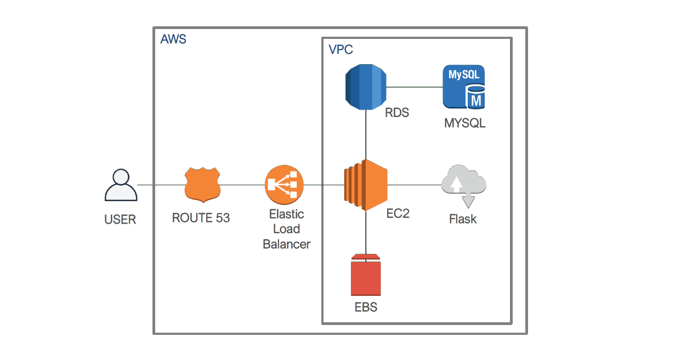
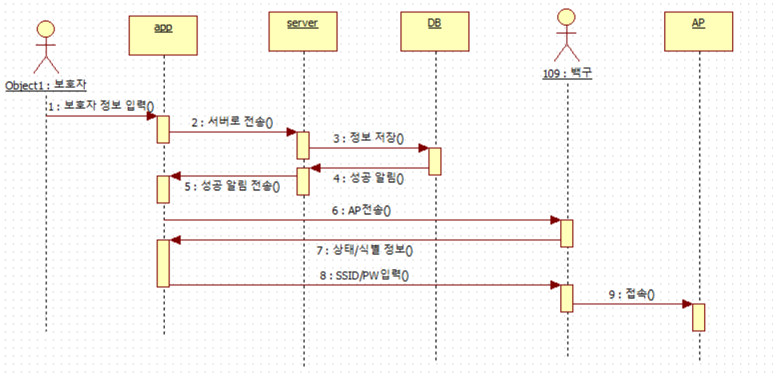
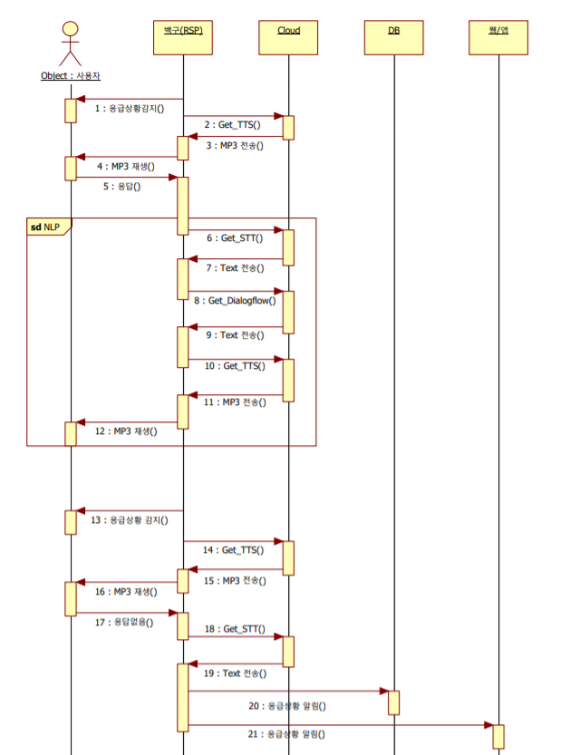

## 주요 코드는 master 브랜치가 아닌 issue1 브랜치에 있습니다.

>[109center](www.109center.com:5000)  

## 🐶 독거노인을 위한 돌봄서비스 반려로봇, ‘백구’🐶
컴퓨터비전과 음성인식으로 생활패턴을 학습하여 소외된 **독거노인을 신체적, 정신적으로 케어**합니다.

##### 반려동물을 대체할 ‘반려로봇’
 * 홀로 반려동물을 돌보기가 어려운 독거노인을 위한 AI 반려 로봇을 제작하고자 합니다. 우울함을 완화시켜 줄 수 있도록 > 반려동물 외형 및 말벗기능으로 반려동물과 같은 교감을 가능하게 합니다.
 ##### 독거노인을 위한 ‘돌봄 서비스’
 * IoT 센서 및 AI 영상 인식으로 약 복용 알림 및 위험감지 기능을 제공하여 단순 반려 로봇 기능 이상의 헬스 케어 시스템 역할을  가능하게 합니다. 관제 시스템을 통해 독거노인의 상태를 감지하여 모니터링 하는 기능을 구현합니다.

****

## Tech

* [vscode](https://code.visualstudio.com/) - 편집기
* [MySQL](https://www.mysql.com/) - DataBase
* [MySQL Workbench](https://www.mysql.com/products/workbench/) - MySQL 시각화 툴
* [AWS EC2](https://aws.amazon.com/ko/ec2/) - 클라우드 환경 컴퓨팅 시스템
* [AWS RDS](https://aws.amazon.com/ko/rds/) - 클라우드 환경 데이터베이스 관리 시스템
* [AWS S3](https://aws.amazon.com/ko/s3/) - 클라우드 스토리지
* [AWS EC2](https://aws.amazon.com/ko/ec2/) - 클라우드 스토리지
* [Flask](https://flask.palletsprojects.com/en/1.1.x/) -  Python의 마이크로 웹 프레임워크
* [bootstrap](https://getbootstrap.com/) -  빠르고 간편한 반응형 웹 디자인(responsive web design)을 위한 open-source front-end framework
* [Flutter](https://flutter.dev/) - Android 와 IOS의 크로스 플랫폼 모바일 앱 개발 프레임워크
* [Raspberry Pi](https://www.raspberrypi.org/documentation/usage/gpio/)

## Main Fuction
| 주요 기능 | 설명| 
| ------ | ------ | 
| 영상인식 | 낙상감지를 통하여 응급상황 시 관제 센터 및 보호자 알림 |
| 음성인식 | 능동적 말벗 기능을 통하여 외로움 완화 및 친근한 대화 유도 및 약 복용 알림 기능| 
| 위험감지 | 온/습도 등 집 상태를 모니터링 하여 응급상황 시 센터에 자동 신고 기능 | 
| 보호자 앱| 로봇 초기설정 및 사용자 정보 input 기능 |
| 웹 관제 | 수집한 데이터를 시각화하는 대시보드 구현 | 

****

## Server Architecture

	

## Sequence Diagram
##### 1. 로봇 초기설정 시 다이어그램
* 보호자가 초기 백구를 설정하는 다이어그램입니다. 백구 앱을 통해 보호자 및 사용자의 정보를 입력하고 서버를 거쳐 DB에 저장됩니다. 모든 정보 입력을 마치면 백구와의 통신을 시작합니다.

	

##### 2.응급상황 시 응답 여부에 따른 다이어그램
* 백구가 응급상황을 감지했을 경우 NLP 통신을 통해 사용자의 상태를 확인합니다. 사용자의 응답이 없을 경우 서버와 웹/앱으로 응급상황 알림을 전송합니다.

	

