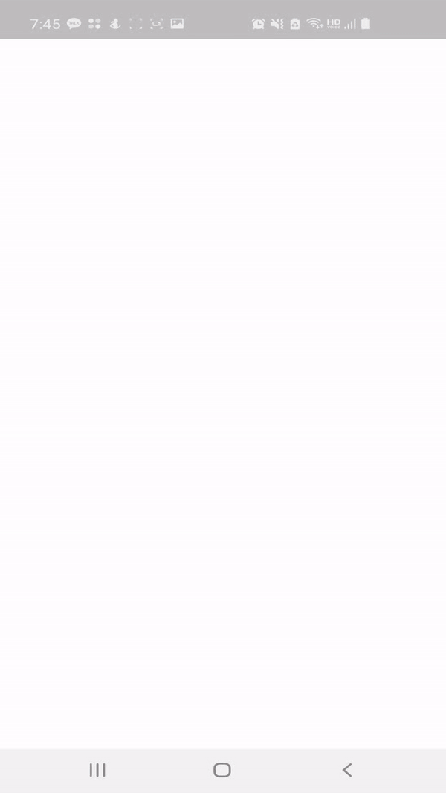
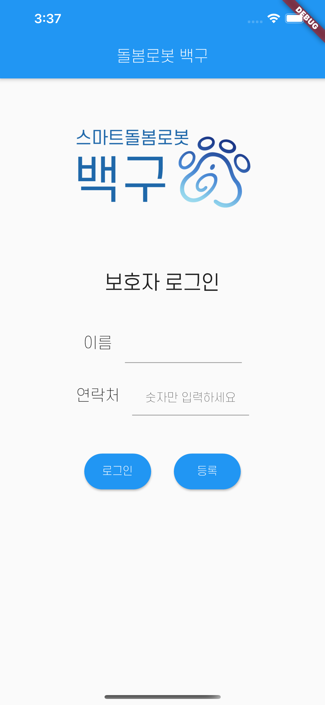
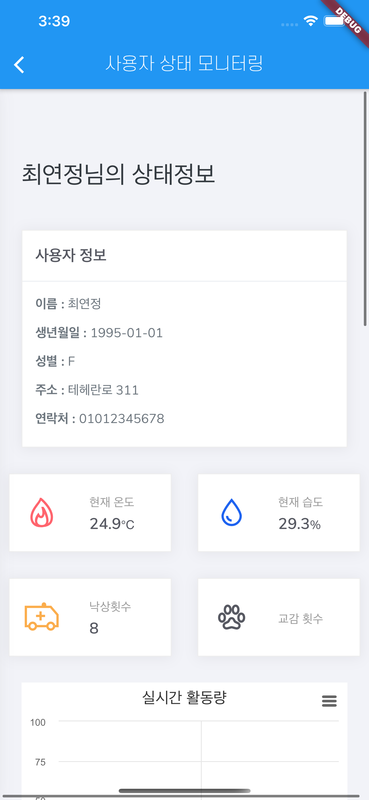
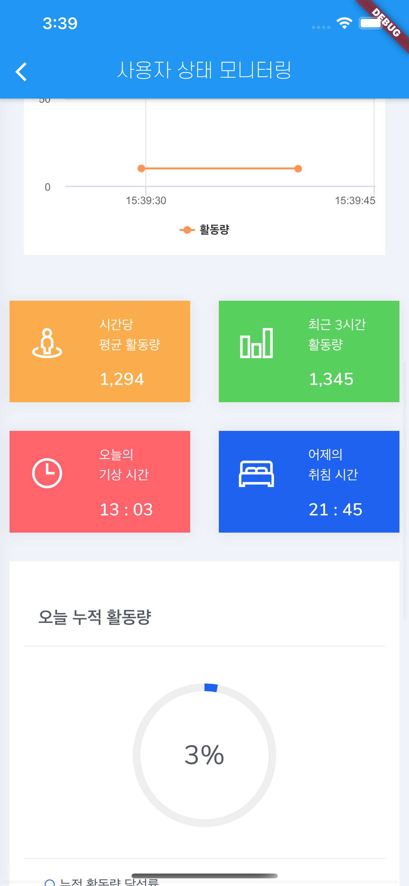
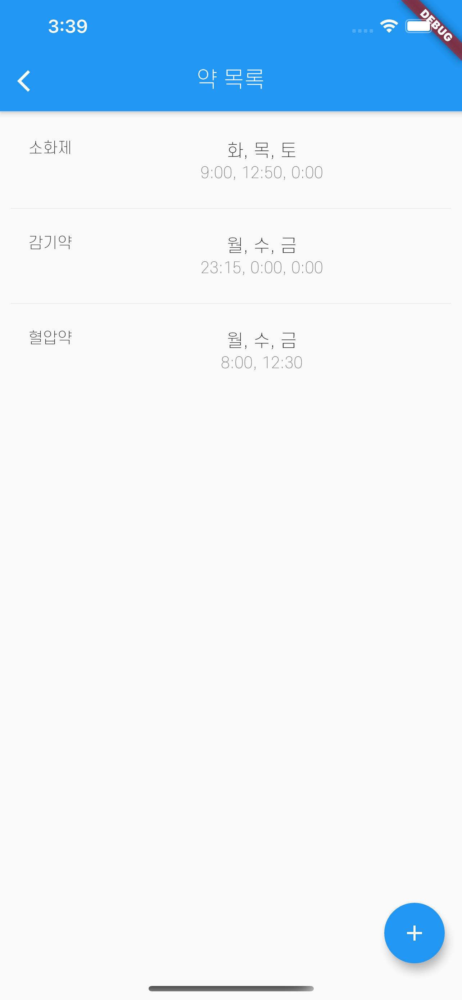
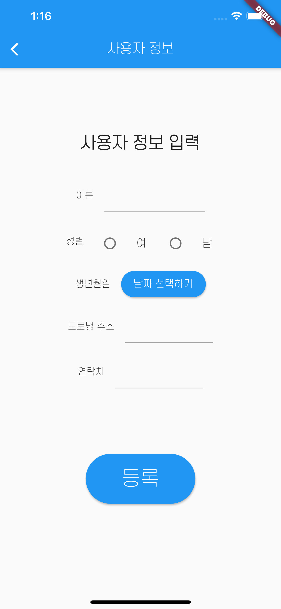

# Flutter 

Flutter는 Google에서 개발한 크로스 플랫폼 모바일 앱 개발 프레임워크입니다. 저희 팀은 아래와 같은 이유로 Flutter 플랫폼을 활용하여 앱 개발을 하였습니다.

### 장점
- iOS와 Android 두 OS에 대해 고품질 기본 인터페이스를 제작하는 데 도움을 주는 크로스 플랫폼 프레임워크
- 다양한 개발환경(Android Studio, VS Code 등등)를 사용하여 빌드가 가능
- 직접 컴파일되서 렌더링하기 때문에 성능이 빠름

# Development

### 1. 로봇 초기 설정

&nbsp;&nbsp;

**1. 보호자 및 사용자 등록**
 
보호자의 이름, 연락처를 이용하여 등록하고

메뉴 중 초기 설정에 들어가 사용자의 기본정보를 등록한다.

**2. 네트워크 연결**

로봇의 Wi-Fi를 연결하기 위해 연결하려는 Wi-Fi의 SSID 및 PSK를 입력한다.

위의 과정이 끝나면, 로봇이 재부팅되며 네트워크 연결이 성공한다.

### 2. 사용자 상태 모니터링

&nbsp;&nbsp;

**1. 보호자용 관제 대시보드 접속**

한 보호자 당 다수의 사용자를 관리하고 있을 경우를 대비하여 모니터링 대상자를 선택할 수 있도록 하였다.

모니터링 대상자를 선택한 후, 보호자용 관제 대시보드 웹에 접속하여 사용자의 상태를 실시간 모니터링 할 수 있다.

### 3. 사용자 약 정보 입력

&nbsp;&nbsp;

**1. 사용자 약 정보 확인**

확인하려는 대상자를 선택하면, 보호자가 입력한 약 정보(약의 이름, 복용할 날짜, 복용할 시간 등)를 확인할 수 있다.

**2. 사용자 약 정보 입력**

+모양의 Floating Button을 이용하여 추가적으로 복용 알림해야 할 약 정보들을 입력할 수 있다.
