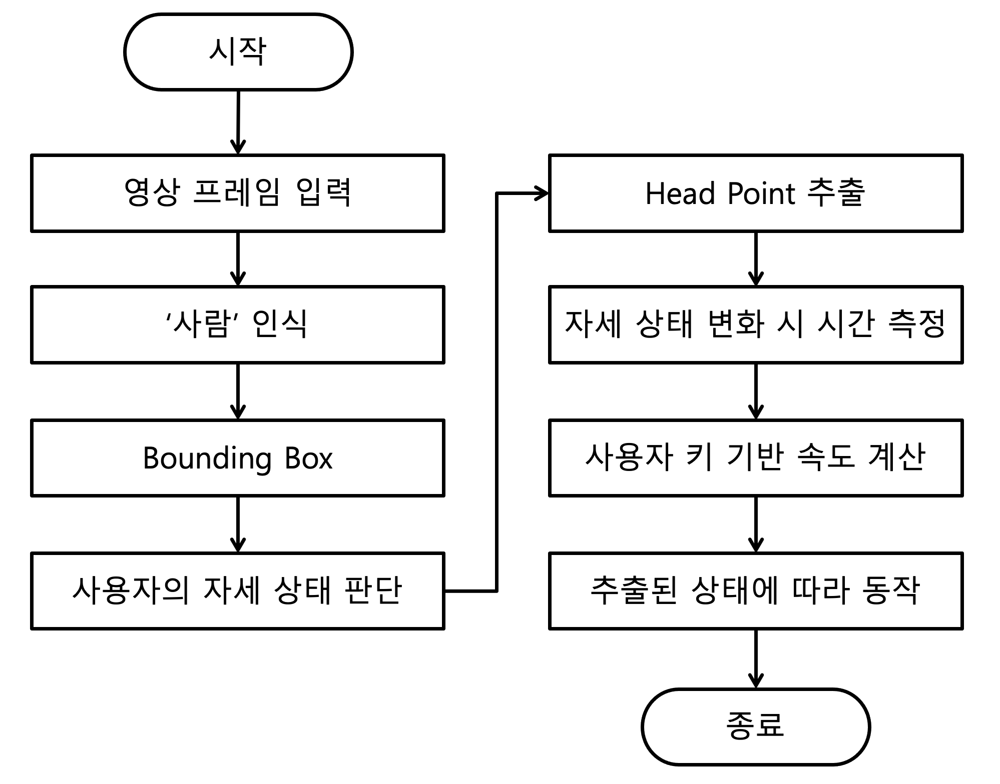
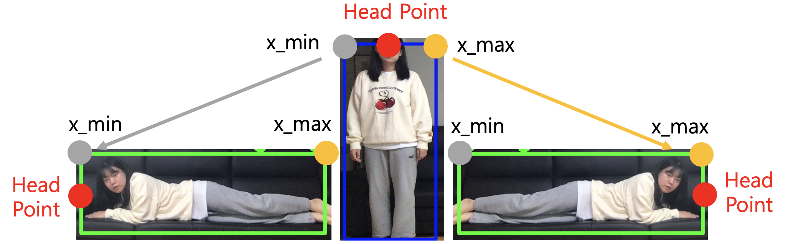
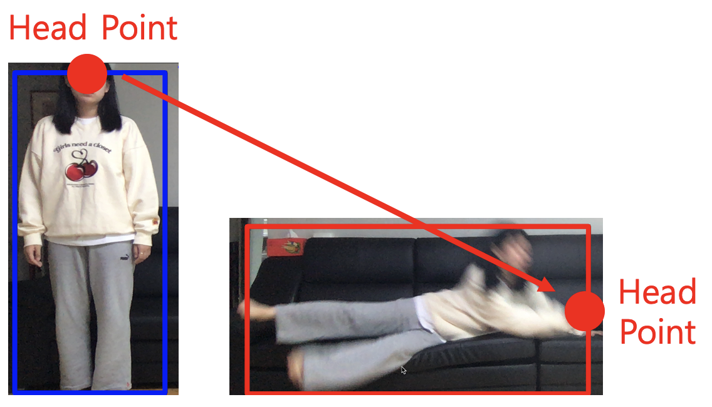

 

# Development
### 1. 낙상 인식 알고리즘

**1. Bounding Box로 비율 계산**
 
W(width)와 H(height)를 기준으로 세 가지 상태로 분류한다.
- H > W : 서 있는 상태
- H < W : 눕거나 앉아있는 상태
- H < W/2: 완전히 누운 상태

**2. Head Point 추출**

상태가 변하면서 X축 변화폭이 큰 쪽을 Head Point로 선택한다.
> 1. '서 있는 상태'에서 추출된 (x_min+x_max)/2 = x_center를 임시 Head Point(x_center, y_min)로 설정
>
> 2. '누운 상태'가 되면, x_min과 x_max 중 변화폭이 큰 쪽을 Head Point(x, y_center)로 설정

**3. 시간 측정**

완전히 누운 상태가 측정되었을 때, 가장 최근 서있는 상태의 시간과의 시간 차이를 계산하고,

시간 차이가 임계치보다 빠르면 1차적으로 낙상으로 인식한다.

**4. 속도 계산**

사용자의 키를 기반으로 실제 이동거리를 구하여 속도를 계산한다.

>Head Point 변화 거리 : 영상 속 사용자의 Y축 길이 = 실제 거리 : 사용자의 실제 키

∴ 속도 = 실제 거리 / 상태 변화 시간 (m/s)

구한 속도가 임계치보다 빠르면 최종적으로 낙상으로 인식한다.

### 2. 활동량 계산

**1. 서 있는 상태 인식**

운동 및 가벼운 움직임은 서 있는 상태일 때가 많기 때문에 우선 서 있는 상태가 인식되었을 때, 활동량 계산을 준비한다.

**3. Center Point 추출**

Bounding Box의 정 가운데 점을 Center Point로 선택한다.

**2. X축 및 Y축 변화량 측정**

서 있는 상태일 때의 Center Point의 X축 및 Y축 변화량이 임계치 이상이면 '**활동**'이라고 인식한다.

### 3. 기상 및 취침 인식

**1. 시간대 측정**

노인 평균 기상 및 취침시간을 바탕으로, 해당 시간대에 속해있을 때 기상 및 취침 인식을 준비한다.

**2. 기상 및 취침 인식**

일정 시간 이상 동안 누운 상태가 지속되었을 때 사용자의 기상 및 취침을 판단한다.
